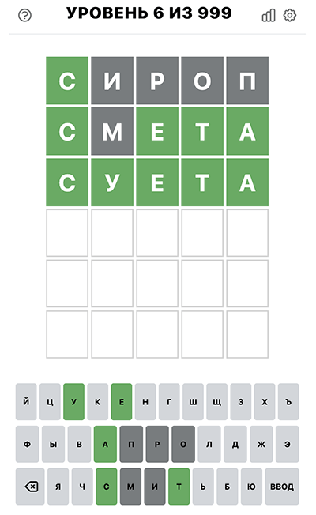

# Подбор загаданного слова в wordle

Поиск загаданного слова в wordle.
Консольно приложение.

Приложение не гарантирует что у вас получится угадать слово. 
Все зависит выбираемых вами слов. Это только помощник.

С другими языками тоже будет работать, нужен только соответствующий словарь.

Для подбора слова другом длины нужен соответствущий словарь и поменять константу `LENGTH`.


## Как использовать

````
make build
./dict5slov-srch -1 б -i укв -e ж
````

## Описание команд

**Встроенная справка по командам**

`-h`

**Когда известно точное местоположение буквы**

По одной букве. Если передать несколько букв, будет использована первая.
````
-1 б
-2 у
-3 к
-4 в
-5 а
````

**Когда буква(ы) угадана без точного местоположения**

Одна или несколько букв подряд без разделителя
````
-i абвг
````

**Буквы которые точно не встречаются в загаданном слове**

Одна или несколько букв подряд без разделителя
````
-e буквы
````

## Пример использования

- Запускаем wordle
- Первое слово вбиваем сами, какое больше нравится. Например: сироп
- Результат ввода:
  - c - зеленая, найдена
  - ироп - серые, не встречаются
- Используем этот результат для поиска: `./dict4slov-srch -1 с -e ироп`. Указываем точное положение первой буквы и буквы которые точно не встречаются.
- В результате вам будет предложено 122 слова на выбор. Выбирайте какое больше нравится.
Лучше выбрать слово в котором буквы не повторяются и есть часто используемые буквы. Выбираем: смета
- Результат ввода:
  - c - зеленая, мы ее угадали ранее
  - м - серая, не встречается
  - ета - зеленые, угадали
- Используем этот результат для дальнейшего поиска. Добавляем дополнительные вводные к аргументам первого поиска: 
`./dict5slov-srch -1 с -3 е -4 т -5 а -e иропм`. Указываем точное положение уже угаданных букв, к списку не угаданных букв добавляем букву *м*
- Результат поиска:
````
Условия поиска
1 - с
2 -
3 - е
4 - т
5 - а
включая: (0)
исключая: (5) и, р, о, п, м

Подходят слова:
суета
````
- Вводим в wordle третьей строкой слово суета.
- Готово



